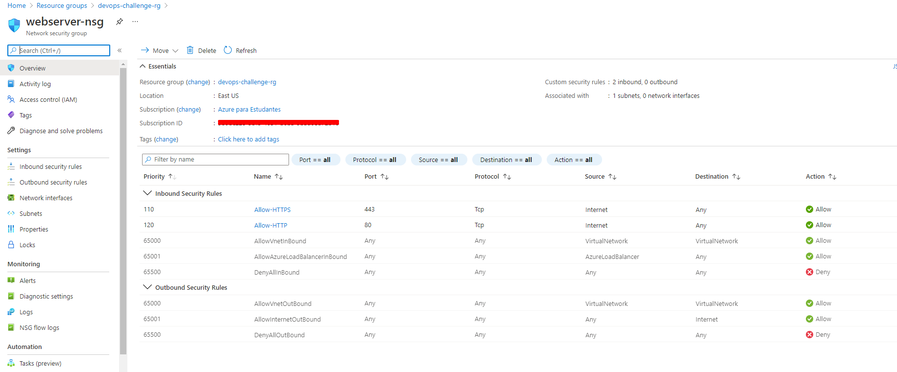
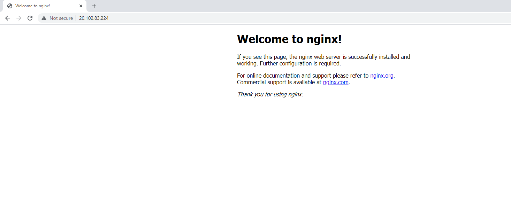
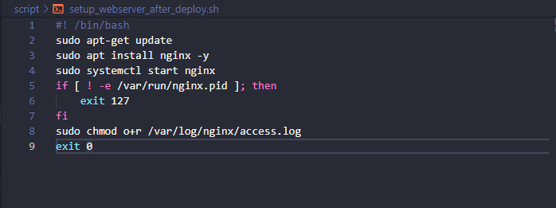
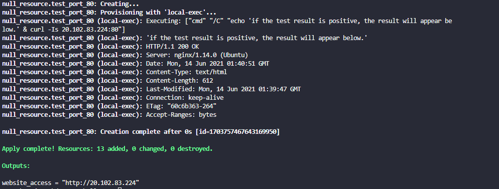
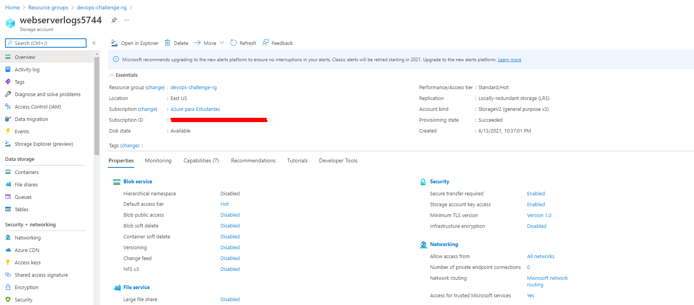
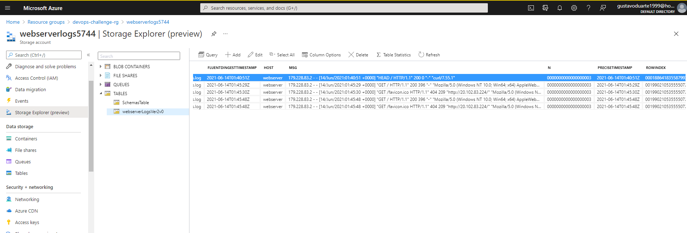

# DevOps Challenge - Ampli

## Challenge detais

### Build a project terraform with the following characteristics :

- (1) Create a Virtual Machine, with a public ip
- (2) Expose HTTP and HTTP/S protocols
- (3) Install a NGINX web server.
- (4) Ensure the execution of the webserver.
- (5) Test connection with port 80
- (6) Create a storage
- (7) Send the NGINX log to the created storage.

&nbsp;

## Provider

### This project uses Microsoft Azure

- The authentication used was service principal

### Authentication variables below :

| Name | Description | Type | Required |
|------|-------------|:----:|:-----:|
|azure_subscription_id|Azure Subscription ID|string| ✅ |
|azure_client_id|Azure Client ID|string| ✅ |
|azure_client_secret|Azure Client Secret|string| ✅ |
|azure_tenant_id|Azure Tenant ID|string| ✅ |

&nbsp;

## Inputs

| Name | Description | Type | Default | Required |
|------|-------------|:----:|:-----:|:-----:|
|webserver_admin_username|Username for Virtual Machine administrator account|string|null| ✅ |
|webserver_admin_password|Password for Virtual Machine administrator account|string|null| ✅ |
|location|Location to deploy resources|string|eastus|  |
|vnet_cidr|The CIDR of the network VNET|string|10.10.0.0/16|  |
|webserver_subnet_cidr|The CIDR for the network subnet|string|10.10.1.0/24|  |
|webserver_size|Size of the virtual machine to create|string|Standard_B2s|  |

&nbsp;

## Outputs

| Name | Description |
|------|-------------|
|website_access|URL to access the web server|

&nbsp;

# Task challenge validation

### (1) Create a Virtual Machine, with a public ip

### (2) Expose HTTP and HTTP/S protocols

### (3) Install a NGINX web server.

### (4) Ensure the execution of the webserver.

### (5) Test connection with port 80

### (6) Create a storage

### (7) Send the NGINX log to the created storage.

